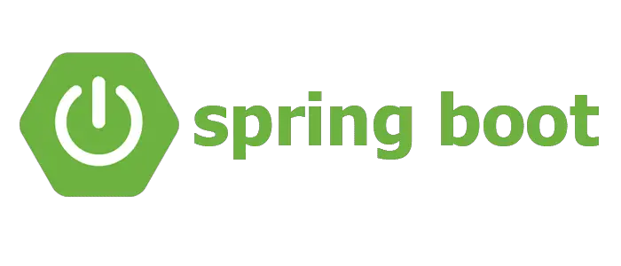

<!--
**DishanGayantha/DishanGayantha** is a ✨ _special_ ✨ repository because its `README.md` (this file) appears on your GitHub profile.

Here are some ideas to get you started:

- 🔭 I’m currently working on ...
- 🌱 I’m currently learning ...
- 👯 I’m looking to collaborate on ...
- 🤔 I’m looking for help with ...
- 💬 Ask me about ...
- 📫 How to reach me: ...
- 😄 Pronouns: ...
- ⚡ Fun fact: ...
-->

 
 

 

  
  
  

<h1 align="center">Hi , I am Dishan Gayantha </h1>
<h3 align="center">Fullstack Developer</h3>

 

  <em>
    Hello, I am Dishan Gayantha a <b>3rd year</b> Software Engineering undergraduate from <a href="https://www.sliit.lk/"> <b>Srilanka Institute Of Information Technology (SLIIT)<b/></a>.  
    <b>Passionate about software development | self-learner | Problem Solver</b> 
     

  
      
      

  </em> 
   
       <b>Thought : <i>"Life is full of choices…choose wisely!”</i></b> 

  

### About me ....

🗣️  Callme: ***He/His*** or ***TeamWorker*** 😊  
👨‍💻  I’m currently learning about Springboot /Spring/ Cloud Infrastructure & Services🥰 
🤠 I’m looking to collaborate with any **Open - Source software development projects** 
🤓  Fun fact : *I Always try to learn something new and then sleep till it store in the brain* 😠   
 

###  Tools and Technologies I work with:

  
  <code>  </code>
  <code>  </code>
  <code>  </code>
  <code>  </code>
  <code>  </code>
  <code>  </code>
  <code>  </code>
  <code>  </code>
  <code>  </code>
  <code>  </code>
  <code>  </code>
  <code>  </code>
  <code>  </code>
  

  

 &nbsp;<i><b>Git Activeness</b></i>

 

&nbsp;

     

<!--
&nbsp;Git profile Trophies
 
-->

-----
Credits: [Dishan Gayantha](https://github.com/DishanGayantha)

Last Edited on: 25/08/2025

